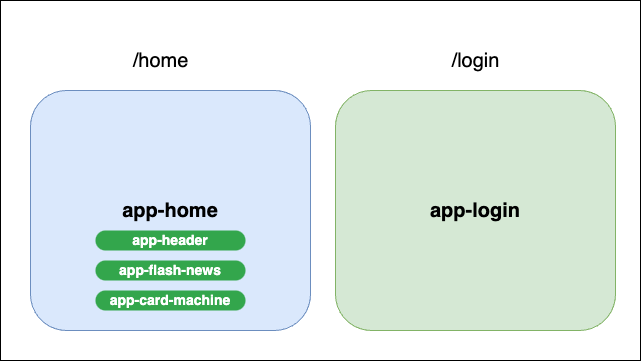

# Sonar-Project

## :rocket: Prettier

Afin de formater le code, un hook precommit est configuré

## :rocket: Standalone components

Ce projet utilise les standalone components (Le projet n'a aucun NgModule)
ce qui nous permet d'avoir moins de fichiers, mais aussi de mieux définir les imports (dépendence) de chaque component

## :rocket: Unit tests

Des tests unitaires ont étaient rajoutés au niveau du pipe "AddLine".

## :rocket: Schema
Ce projet contient deux pages:
- une page login qui contient un formulaire pour se connecter.
- une page home qui est composée de trois components et qu'on peut l'accéder si on est connecté.

## :rocket: Shared
Service, pipe et models ont été ajoutés au niveau du Shared et les imports se font à partir @shared/models, @shared/pipes et @shared/services
